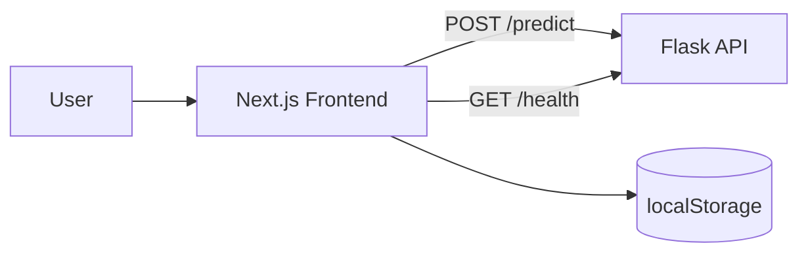

# Prediction Price Car Website


> Frontend interaktif untuk memprediksi harga mobil berbasis model Linear Regression melalui integrasi API Flask.

Project ini adalah aplikasi web Next.js (App Router) untuk demo sistem prediksi harga mobil pada konteks UAS Sains Data. Pengguna mengisi 8 fitur teknis kendaraan, lalu aplikasi mengirim request ke endpoint prediksi dan menampilkan estimasi harga dalam USD.

Selain form prediksi, aplikasi menyediakan dashboard visual untuk insight dataset, halaman riwayat prediksi yang tersimpan di browser (localStorage), serta halaman informasi metodologi. UI dibangun menggunakan shadcn/ui + Tailwind CSS dan sudah dioptimalkan untuk desktop maupun mobile.

## ✨ Fitur Utama

- Prediksi harga mobil dari 8 fitur input numerik (`Engine_size`, `Horsepower`, `Wheelbase`, `Width`, `Length`, `Curb_weight`, `Fuel_capacity`, `Fuel_efficiency`)
- Validasi form berbasis `zod` + `react-hook-form` dengan feedback error yang jelas
- Integrasi API `POST /predict` + fallback parsing beberapa format response
- Retry koneksi API otomatis pada startup hingga status `online`, dilengkapi loading overlay
- Indikator status API real-time di navigation bar (warna + tooltip status)
- Riwayat prediksi lokal (maksimal 100 data) dengan hapus item dan clear all
- Dashboard statistik (bar chart, scatter plot, tabel top cars) menggunakan Recharts

## 🏗️ Arsitektur & Tech Stack



### Tech Stack

| Kategori | Teknologi |
|---|---|
| Framework Frontend | Next.js 15 (App Router) |
| UI Runtime | React 19 |
| Bahasa | TypeScript |
| Styling | Tailwind CSS v4, `tw-animate-css` |
| UI Components | shadcn/ui (preset `radix-nova`), Radix UI, Lucide Icons |
| Form & Validation | react-hook-form, zod, @hookform/resolvers |
| Data Visualization | recharts |
| Notification | sonner |
| Theming | next-themes |
| Quality Tooling | ESLint (Next core-web-vitals + TypeScript config) |

Arsitektur aplikasi bersifat komponen-modular: halaman di `app/` sebagai routing layer, komponen domain di `components/`, dan konstanta/utility data di `lib/`. Seluruh akses API frontend terpusat menggunakan `API_BASE_URL` dari `lib/car-data.ts`.

## 📋 Prerequisites

- Node.js 18.18+ (disarankan Node.js 20 LTS)
- Package manager: `pnpm` (direkomendasikan karena tersedia `pnpm-lock.yaml`) atau `npm`

## 🚀 Instalasi & Setup

### 1. Clone Repository

```bash
git clone <url-repository-anda>
cd prediction-price-car-website
```

### 2. Install Dependencies

```bash
pnpm install
```

Alternatif dengan npm:

```bash
npm install
```

### 3. Konfigurasi Environment

Buat file `.env.local` di root project:

```bash
NEXT_PUBLIC_API_URL=https://data-science-prediction-price-car-s.vercel.app
```

Catatan:
- Variabel `NEXT_PUBLIC_API_URL` bersifat optional (ada default fallback di kode).
- Prefix `NEXT_PUBLIC_` wajib agar bisa diakses dari client component Next.js.

## 💻 Menjalankan Project

### Development

```bash
pnpm dev
```

### Production

```bash
pnpm build
pnpm start
```

### Quality Check

```bash
pnpm lint
```

Catatan: saat ini belum ada suite test otomatis terpisah (`test` script belum tersedia di `package.json`).

## 📁 Struktur Project

```text
prediction-price-car-website/
|- app/
|  |- page.tsx                # Halaman utama prediksi
|  |- dashboard/page.tsx      # Halaman dashboard statistik
|  |- history/page.tsx        # Halaman riwayat prediksi
|  |- about/page.tsx          # Halaman informasi project/model
|  |- layout.tsx              # Root layout + header/footer/provider
|  `- globals.css             # Theme tokens dan style global
|- components/
|  |- prediction-workspace.tsx # Form prediksi + hasil + penyimpanan riwayat
|  |- dashboard-content.tsx    # Visualisasi chart dan tabel dataset
|  |- history-content.tsx      # Manajemen data riwayat localStorage
|  |- site-header.tsx          # Navbar, status API, loading koneksi
|  |- site-footer.tsx
|  `- ui/                      # Library komponen UI shadcn/ui
|- lib/
|  `- car-data.ts              # Konstanta fitur, metrics, helper format, API base URL
|- components.json             # Konfigurasi shadcn/ui
|- package.json                # Scripts dan dependencies
`- README.md
```

## 🔧 Konfigurasi

- `NEXT_PUBLIC_API_URL`: base URL API backend (client-visible env).
- Fallback API URL default didefinisikan di `lib/car-data.ts`.
- Penyimpanan riwayat menggunakan localStorage key: `car-price-prediction-history`.

## 📡 API Reference

### Base URL

`NEXT_PUBLIC_API_URL` atau fallback:

`https://data-science-prediction-price-car-s.vercel.app`

### Endpoints Overview

| Method | Endpoint | Deskripsi | Digunakan di |
|---|---|---|---|
| GET | `/health` | Cek status koneksi API | `components/site-header.tsx` |
| POST | `/predict` | Prediksi harga mobil dari fitur input | `components/prediction-workspace.tsx` |

### Contoh Request Prediksi

```bash
curl -X POST "$NEXT_PUBLIC_API_URL/predict" \
  -H "Content-Type: application/json" \
  -d '{
    "Engine_size": 2.4,
    "Horsepower": 180,
    "Wheelbase": 106.5,
    "Width": 71.2,
    "Length": 188.8,
    "Curb_weight": 3.2,
    "Fuel_capacity": 16.5,
    "Fuel_efficiency": 28
  }'
```

## 🧩 Component Architecture

- `RootLayout` membungkus semua halaman dengan `ThemeProvider`, `TooltipProvider`, header, footer, dan toaster.
- Halaman utama (`PredictionWorkspace`) menangani siklus prediksi end-to-end: input -> validasi -> submit -> hasil -> simpan riwayat.
- `HistoryContent` mengelola data historis di browser tanpa backend tambahan.
- `DashboardContent` menampilkan data statis untuk keperluan insight/presentasi model.

### Routing

- `/` -> prediksi harga mobil
- `/dashboard` -> statistik dataset/model
- `/history` -> riwayat prediksi lokal
- `/about` -> overview project, model, endpoint

## 🔄 ML Pipeline (Context Aplikasi)

Project frontend ini berperan pada fase **deployment/inference** untuk model ML. Berdasarkan informasi di aplikasi, alur CRISP-DM yang ditampilkan adalah:

1. **Business Understanding**
2. **Data Understanding**
3. **Data Preparation**
4. **Modeling**
5. **Evaluation**
6. **Deployment**

Catatan:
- Implementasi training pipeline tidak berada di repository frontend ini.
- Frontend mengonsumsi model melalui endpoint API (Flask) yang dipublikasikan terpisah.

